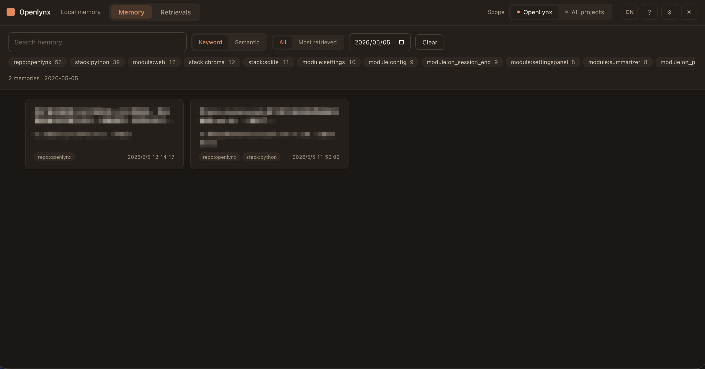

# lynx-memory

[中文 README](./README.zh-CN.md)

Persistent, semantic, long-term memory for [Claude Code](https://claude.com/claude-code).
Conversations are auto-saved across sessions and the most relevant snippets are
injected into context whenever you start a new prompt — no special syntax,
no "remember this" phrasing required.

```
You      : What can I do tomorrow if the weather's nice — maybe walk the dog?
Claude   : Since you've got Dandan (your golden Border Collie) who needs a lot
           of exercise, try a long walk, frisbee, or a bike ride with him
           tagging along… 🐶
            (you never mentioned Dandan or owning a dog — memory recalled it
             from a past chat)
```

## How it works

Three Claude Code [hooks](https://docs.claude.com/en/docs/claude-code/hooks) +
a small Python service:

| Hook              | What it does                                                              |
| ----------------- | ------------------------------------------------------------------------- |
| `UserPromptSubmit` | Embeds your prompt and injects the top-K most similar prior turns. When a turn has a summary, the **summary** is injected instead of the raw prose. |
| `Stop`             | Persists the current user/assistant turn into SQLite + Chroma, then spawns a detached background summarizer that calls the configured API (OpenAI, DeepSeek, or Qwen) to extract long-term memories from the turn. |
| `SessionEnd`       | Calls the configured API to produce a coarse memory summary of the whole session. |

Storage:

- **SQLite** — source of truth for raw turns, per-turn summaries, and session summaries
- **Chroma** — local vector index over turns + summaries
- **Voyage AI** (`voyage-3`) — embeddings
- **OpenAI** (`gpt-4o-mini`, default), **DeepSeek** (`deepseek-chat`), or **Qwen** (`qwen-turbo`) — per-turn and session summarization (any one of `OPENAI_API_KEY`, `DEEPSEEK_API_KEY`, `QWEN_API_KEY` is enough)

## Install

```bash
pip install openlynx
lynx-memory init
```

`init` will:

1. Create the shared OpenLynx home at `~/.openlynx/`
2. Prompt for your `VOYAGE_API_KEY` (get one free at https://www.voyageai.com/)
3. Write the default `.env` (`MIN_SCORE=0.7`, `SUMMARY_ENABLED=1`,
   `SUMMARY_BACKEND=auto`) —
   set `OPENAI_API_KEY`, `DEEPSEEK_API_KEY`, or `QWEN_API_KEY` to enable per-turn summarization
   (configurable later via the Web UI ⚙ Settings panel)
4. Back up your existing `~/.claude/settings.json` and add the three hooks
5. Link shared commands and the OpenLynx skill into supported host directories
6. Print verification steps

If a legacy `~/.claude/lynx-memory/` store exists and `~/.openlynx/` does not,
`init` migrates it to `~/.openlynx/` before installing hooks. If both exist,
OpenLynx uses `~/.openlynx/` and leaves the legacy directory untouched.

The shared home is host-neutral:

```text
~/.openlynx/
  .env
  db/
  commands/
  skills/
```

Claude Code and Codex keep their own hook configuration files, but reusable
OpenLynx files are linked from this shared home into host directories such as
`~/.claude/commands/`, `~/.claude/skills/`, `~/.codex/commands/`, and
`~/.codex/skills/`.

Then open a fresh Claude Code session, chat for a few turns, and run:

```bash
lynx-memory status
```

You should see `turns` and `chroma_turns` counters going up.

## Codex CLI (cross-host memory)

Same memory store, also wired into [Codex CLI](https://developers.openai.com/codex/cli):

```bash
lynx-memory init --target codex   # or --target all to install both
```

This writes `~/.codex/hooks.json`, sets `[features] hooks = true` in
`~/.codex/config.toml`, and registers three hooks (`UserPromptSubmit` →
inject, `Stop` → persist, `SessionStart` → summarize the previous session
since Codex has no `SessionEnd` event).

Codex's `additionalContext` field is fully respected, so retrieved memory
is injected exactly like in Claude Code. **Restart any running `codex`
process for hooks to take effect** — they're loaded at session start.

A turn typed in Claude Code can be recalled inside Codex (and vice versa)
because both write to the same SQLite + Chroma store at
`~/.openlynx/`.

## CLI

```
lynx-memory init           Install hooks, slash commands, and skill links
                             (--goal "..." to set a global goal non-interactively)
lynx-memory init-project   Create a .lynx-memory/ marker in cwd to enable
                             project-level storage (--goal "..." for a project goal)
lynx-memory status         Show data dir, hook registration, DB stats, active goal
lynx-memory goal           View/set/clear the per-scope goal
                             (goal show | set "..." | clear, with --scope)
lynx-memory doctor         Verify Python, deps, API key, settings.json
lynx-memory merge          Merge memory between the project and global stores
                             (--from / --to is project|global, with --dry-run)
lynx-memory delete         Permanently delete memory for a scope
                             (--scope project|global|both, with double confirm)
lynx-memory uninstall      Remove hooks, slash commands, and skill links (keeps your data)
```

## Goals

A **goal** is an optional, per-scope (project or global) statement of what you're
working toward. You can set one at install time (`lynx-memory init`/`init-project`
prompt for it, or pass `--goal "..."`) or any time afterwards:

```bash
lynx-memory goal set "Ship the v2 billing API and migrate existing customers"
lynx-memory goal show          # project + global goals, gating state
lynx-memory goal clear         # active scope, asks to confirm
```

When a goal is set, OpenLynx changes two behaviors for that store:

- **Storage gating** — before a turn is persisted, the configured summarization
  LLM (OpenAI / DeepSeek / Qwen) judges whether it is relevant to the goal. Turns
  judged irrelevant never enter the database. The judgement is **strict** by
  default and **fails open**: if no LLM key is configured or the call errors out,
  the turn is stored, so memory is never lost on a hiccup. Every dropped turn is
  logged to `db/hook.log`.
- **Goal-focused summaries** — per-turn and per-session summaries are steered to
  prioritise information that advances the goal.

With no goal set, memory behaves exactly as before (every turn stored and
summarized). Tunables (`.env`): `GOAL_GATING_ENABLED` (default `1`),
`GOAL_STRICTNESS` (`loose`|`balanced`|`strict`, default `strict`),
`GOAL_JUDGE_TIMEOUT` (seconds, default `8`). Changing a goal does not delete
already-stored turns — it only affects which future turns are kept.

## Slash commands

`lynx-memory init` also installs six global slash commands into
`~/.openlynx/commands/` and links them into host command directories such as
`~/.claude/commands/` and `~/.codex/commands/`:

| Command                         | What it does                                                |
| ------------------------------- | ----------------------------------------------------------- |
| `/lynx-memory-status`         | Show current scope (project vs global) with stats for both  |
| `/lynx-memory-goal`           | View or set the per-scope goal (gates storage, focuses summaries)|
| `/lynx-memory-pull-global`    | Merge global memory into the current project (global → proj)|
| `/lynx-memory-push-global`    | Merge current project memory into global (proj → global)    |
| `/lynx-memory-delete`         | Delete memory with mandatory double confirm (`DELETE` + `y`)|
| `/lynx-memory-history`        | Open a local Web UI to browse, search, tag, and delete turns|

Each of these runs `lynx-memory status` / `merge --dry-run` first and asks
for your approval before any write or destructive action.

## Skills

`lynx-memory init` installs the bundled OpenLynx skill into
`~/.openlynx/skills/openlynx/` and links it into supported host skill
directories such as `~/.claude/skills/openlynx` and
`~/.codex/skills/openlynx`.

## Web UI



Type `/lynx-memory-history` in Claude Code (or run `lynx-memory web`) to
launch a local FastAPI + React UI on `127.0.0.1`. The page opens automatically
in your browser and lets you:

- Switch between **project** and **global** scopes
- Page through every saved turn
- Search by **keyword** (SQL `LIKE`) or **semantic** similarity (Voyage embeddings)
- Tag turns (e.g. `#work`, `#personal`) and filter by tag
- Delete a single turn (also clears its embedding from Chroma)
- See the per-turn **summary** above each turn, with a one-click button to (re)generate it on demand
- Click the **⚙ gear icon** (top-right) to open the **Settings panel** and configure everything in-browser: API keys, summary backend (OpenAI / DeepSeek / Qwen), model, Top-K, min score, and retrieval scope — changes are saved directly to `~/.openlynx/.env`

### Usage

```bash
# default — listens on http://127.0.0.1:9527 and opens your browser
lynx-memory web

# pick a different port
lynx-memory web --port 8080

# or let the OS assign a free port
lynx-memory web --port 0

# don't auto-open the browser (useful in headless / SSH sessions)
lynx-memory web --no-open
```

| Action               | What happens on disk                                                        |
| -------------------- | --------------------------------------------------------------------------- |
| **Delete a turn**    | Row removed from SQLite `turns` and `turn_tags`; embedding removed from Chroma |
| **Add a tag**        | Inserted into SQLite `tags` (created on demand) and `turn_tags`             |
| **Remove a tag**     | Row removed from `turn_tags`; orphaned tag is GC'd from `tags`              |
| **Search (keyword)** | SQL `LIKE` over `user_msg` and `assistant_msg` — no embedding call          |
| **Search (semantic)**| One Voyage embedding per query, then top-K from Chroma                      |
| **Regenerate summary** | One API call (OpenAI, DeepSeek, or Qwen, per `SUMMARY_BACKEND`); writes `summary` / `summary_model` / `summary_ts` back into the `turns` row |

The server only binds to `127.0.0.1`. Press `Ctrl+C` to stop it.

## Project-level vs global

Memory is global by default. Run this in a project root:

```bash
cd ~/code/my-project
lynx-memory init-project
```

It creates a `.lynx-memory/` marker. As long as your cwd is inside that
project, memory transparently switches to the project-level store at
`<project>/.lynx-memory/db/`, isolated from the global one at
`~/.openlynx/`.

Use `/lynx-memory-status` to inspect the active scope, and
`/lynx-memory-pull-global` / `/lynx-memory-push-global` to move history
between the two layers.

## Configuration

All optional, set in `~/.openlynx/.env`:

| Variable                       | Default                              | Purpose                                    |
| ------------------------------ | ------------------------------------ | ------------------------------------------ |
| `VOYAGE_API_KEY`               | —                                    | Required for embeddings                    |
| `TOP_K`                        | `5`                                  | Max memories injected per prompt           |
| `MIN_SCORE`                    | `0.7`                                | Cosine similarity floor (0–1)              |
| `SUMMARY_ENABLED`              | `1`                                  | Set `0`/`false` to disable per-turn summarization |
| `SUMMARY_BACKEND`              | `auto`                               | `auto` → first provider with a key set (OpenAI → DeepSeek → Qwen); force with `openai`, `deepseek`, or `qwen` |
| `OPENAI_API_KEY`               | —                                    | Required when `SUMMARY_BACKEND=openai`     |
| `OPENAI_MODEL`                 | `gpt-4o-mini`                        | OpenAI model used for summarization        |
| `OPENAI_BASE_URL`              | `https://api.openai.com/v1`          | Override for OpenAI-compatible endpoints   |
| `DEEPSEEK_API_KEY`             | —                                    | Required when `SUMMARY_BACKEND=deepseek`   |
| `DEEPSEEK_MODEL`               | `deepseek-chat`                      | DeepSeek model used for summarization      |
| `DEEPSEEK_BASE_URL`            | `https://api.deepseek.com/v1`        | Override for the DeepSeek endpoint         |
| `QWEN_API_KEY`                 | —                                    | Required when `SUMMARY_BACKEND=qwen` (`DASHSCOPE_API_KEY` also accepted) |
| `QWEN_MODEL`                   | `qwen-turbo`                         | Qwen model used for summarization          |
| `QWEN_BASE_URL`                | DashScope compatible-mode URL        | Override for the Qwen/DashScope endpoint   |
| `LYNX_MEMORY_DIR`              | `~/.openlynx`                         | Where SQLite + Chroma live                 |

## Optional: MCP server

You can also expose memory as MCP tools for Claude Code (`search_memory`,
`list_recent`, `stats`, `forget`). Add to `~/.claude.json` or `.mcp.json`:

```json
{
  "mcpServers": {
    "lynx-memory": {
      "command": "lynx-memory-mcp"
    }
  }
}
```

## Uninstall

```bash
lynx-memory uninstall                   # remove hooks + slash commands + skill links
lynx-memory delete --scope global       # delete the global store (confirms)
# or
rm -rf ~/.openlynx                       # nuke directly (irreversible)
```

## Privacy

- All data stays on your machine in `~/.openlynx/`.
- Outbound calls: **Voyage AI** for embeddings (your prompt text); **OpenAI**, **DeepSeek**, or **Qwen**
  for per-turn and session summaries (requires an API key — set via `.env` or the Web UI ⚙ Settings panel).
- Set `SUMMARY_ENABLED=0` if you don't want per-turn summaries to leave the box.
- Set `LYNX_MEMORY_DIR` to encrypt at rest with whatever filesystem-level
  encryption your OS provides.

## Roadmap

- [x] **Project-level / global dual-layer storage**
  Global by default; auto-switches to project-level when a `.lynx-memory/`
  marker is found by walking up from cwd, so histories from different
  projects don't bleed into each other. Run `lynx-memory init-project`
  in a project root to create the marker. Search supports
  `scope=auto|project|global|merged` (hooks via `LYNX_MEMORY_SCOPE` env;
  MCP tools accept a `scope` argument).

- [x] **Codex CLI** — same hooks + shared store; use `lynx-memory init --target codex` (or `--target all`). See [Codex CLI](#codex-cli-cross-host-memory) above.

- [x] **Local Web UI memory browser**
  A local FastAPI + React UI with paging, keyword / semantic search,
  single-turn deletion, and tagging (e.g. `#work`, `#personal`). Launch with
  `/lynx-memory-history` (or `lynx-memory web`); the page exposes both
  project-level and global histories with a one-click scope toggle.

- [ ] **Other CLIs (Cursor, Gemini CLI, …)** — not integrated yet. **Cursor**: blocked until a stable hooks surface ships (we plan to adopt it once available); meanwhile MCP-only workflows remain possible where applicable.
- [ ] **Unified multi-client installer**
  A future `lynx-memory install --client <name>` to write MCP configs in one shot,
  with rules templates for consistent recall across clients that support them.

- [ ] **Import / export & cross-device sync**
  `lynx-memory export` / `import` for JSONL backup and restore; place `db/`
  in iCloud / Dropbox / a Git repo, or use a built-in `lynx-memory sync`
  subcommand to share memory across machines.

- [ ] **Richer automatic tagging (precise vs associative)**
  Stronger auto-labeling for turns, with a switchable **precise** mode
  (tight, literal, auditable tags) vs **associative** mode (broader links
  and softer clusters to improve semantic recall).

- [ ] **Recall modes & tunable ranking**
  Let users steer what gets injected beyond raw similarity — combine signals such as
  **retrieval / hit count**, **relevance score**, and **recency** (last used or last
  injected), with presets or manual weighting so priority matches your workflow.

## License

MIT — see [LICENSE](./LICENSE).
